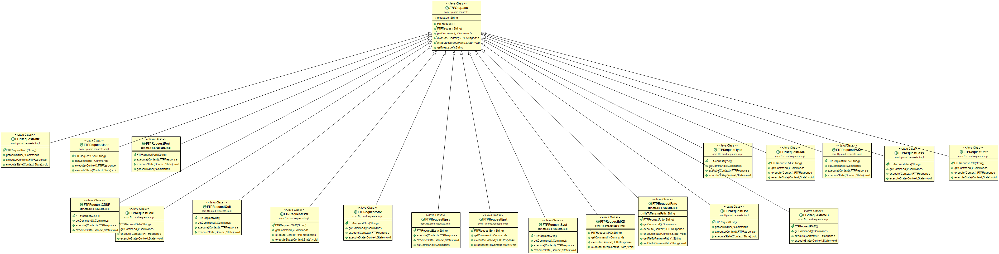
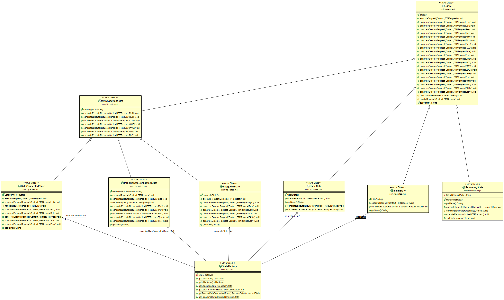

# Rendu TP FTP-Server
Réalisé par Louis GUILBERT et Jonathan LECOINTE

13/02/2017

---

## Introduction
Ce logiciel est un serveur FTP. Il permet de se connecter à distance pour
uploader, télécharger, ou gérer des fichiers.

Dans notre implémentation, nous avons décidé d'utiliser un système de machines
à états, chaque état n'acceptant que certaines commandes précises pour agir
sur le serveur.

## Architecture
### Les requêtes
Notre serveur FTP est capable de recevoir des requêtes du client. Il existe
différents types de requêtes bien précises, nous avons donc décidé de créer
une énumération afin d'énumérer toutes les requêtes possibles.

Cette énumération nous permettra également de créer un objet de la classe fille
de _FTPRequest_ correspondant à cette commande, qui contiendra les paramètres
envoyés par le client et le comportement à adopter lors de l'exécution d'une
telle requête.




### La machine à états
Comme dit précédemment, notre système utilise un système de machines à état,
décrite par l'uml ci-après.



Sur cet UML, nous pouvons voir que l'on a une classe abstraite _State_. Dans
cette classe, nous avons implémenté une méthode par type de requête possible.
Ces méthodes de bases renvoient ici un message d'erreur au client. De cette
manière, pour chaque état enfant, il suffira d'override les méthodes
correspondant aux commandes qu'ils souhaitent traiter, et les autres seront
automatiquement refusées.

Un problème s'est posé à nous lors de cette implémentation. En Java, le type
concret des objets passés en paramètre n'est pas connu. Ainsi, si on a le cas
suivant :

```
class A {
  public void fonction() {}
}

class B extends A {

  @Override
  public void fonction() {}
}

class C {

  public C (A variable) {
    variable.fonction();
  }

}
```

Il n'est pas possible de savoir si le type concret de la variable dans la classe
C est A ou B.
Le problème s'est présenté pour nous avec les _FTPRequest_. Lorsque l'on
souhaite les exécuter dans les états, on ne connait pas leur type concret, c'est
donc la méthode de la classe abstraite qui serait appellée, et celle-ci est
utilisée pour renvoyer une erreur dans tous les états n'implémentant pas cette
commande. On ne peut donc pas traiter les requêtes de manière discriminée
(CAD appeller une fonction différente selon leur type concret grâce à la
  surcharge de méthodes).
Pour résoudre ce problème, nous avons utilisé le [double dispatch.](https://en.wikipedia.org/wiki/Double_dispatch)

Les classes filles de la classe _State_ overrident toute la méthode
executeRequest. Celle-ci appelle la fonction _executeState_ sur la _FTPRequet_,
qui ne fait elle même qu'appeller la fonction concreteExecuteState sur le _State_
d'origine.

Exemple avec une requête de type **USER** envoyée à un InitialState :
```
public class InitialState extends State {

  @Override
  public void executeRequest(final Context context, final FTPRequest request) {
    //Première étape
    super.executeRequest(context, request);
    request.executeState(context, this);
  }

  @Override
  public void concreteExecuteRequest(final Context context, final FTPRequestUser request) {
    // Troisième étape
    [...]
  }

public class FTPRequestUser extends FTPRequest {
  @Override
  public void executeState(final Context context, final State state) {
    // Seconde étape
    state.concreteExecuteRequest(context, this);
  }
}
```

On voit ici que lorsque l'on appelle _executeRequest_ sur le _InitialState_,
le type concret de la _FTPRequest_ n'est pas visible. En appellant
`request.executeRequet()`, cette méthode étant abstraite dans la classe _State_,
on accède à l'implémentation de la classe concrète, _FTPRequestUser_. Celle-ci
appelle _concreteExecuteRequest()_ en passant _this_ en paramètre, permettant
de connaître le type concret, et donc la bonne méthode.

### Gestion des exceptions
Dans ce programme, il y a deux cas lors desquels nous devons gérer des
exceptions:

* Les erreurs des requêtes

Certaines requêtes des clients peuvent provoquer des erreurs. Par exemple, si un
client envoie une requête de type EPSV mal formatée, avec par exemples des
lettres là ou devrait se trouver le port, une exception sera levée.

Dans ce type de cas, l'exception est interceptée par la requête qui exécute cette
commande, et répond au client par une erreur appropriée.

* Les erreurs d'exécution

Autre cas, des requêtes peuvent provoquer des erreurs à l'exécution. Par exemple,
l'ouverture d'une socket peut parfois provoquer une _IOException_. Dans ces cas
là, on lance une _RuntimeException_, qui déconnecte violemment le client du
serveur.


### Code Samples
* Design Pattern Factory

Pour la gestion des états, la plupart d'entre eux n'ont besoin d'être instanciés
qu'une fois, ces derniers ayant le même comportement quel que soit le client
(à l'exception du _RenamingState_, qui n'aura donc pas le même traitement que
les autres états).

Nous avons donc réalisé une Factory : on instancie une seule fois chaque état,
et lorsqu'une classe souhaite accéder à un état, elle appelle la Factory. Par
exemple, si on souhaite accéder à l'état _LoggedInState_ :

```
public class StateFactory {

  private final static LoggedInState loggedInState = new LoggedInState();

  public static LoggedInState getLoggedInState() {
    return loggedInState;
  }
}

StateFactory.getLoggedInState()
```

* Design Pattern Visitor

Le comportement décrit précédemment pour le double dispatch utilise le Pattern
visitor. Dans cet exemple, les classes _FTPRequest_ sont les classes visitables,
 et les classes _State_ sont les visiteurs.

* Design Pattern Singleton

La base de données a besoin d'être accessible à plusieurs endroits du programme,
et celui-ci ne nécessite que d'une seule instanciation. Nous l'avons donc
implémentée en suivant le pattern Singleton :

```

public class Database {
  private static Database instance = new Database();

  private Database() {
    [...]
  }

  public static Database getInstance() {
    return instance;
  }

  // Accès à la base de données

  Database.getInstance();

```
